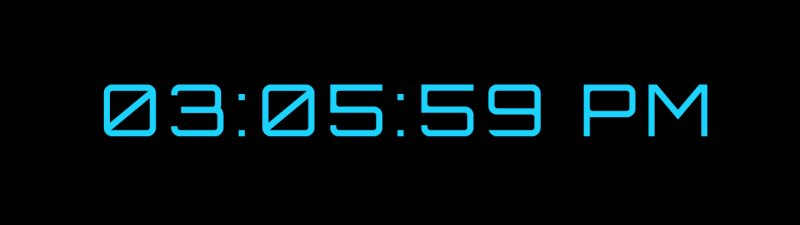

### 2: JAVASCRIPT CLOCK

Building your own digital clock with JavaScript is a relatively easy small project to practice variables and simple if loops.

Again, you want to use some SASS to customize the design and make your JavaScript clock look fancy.
# Digital_Clock
